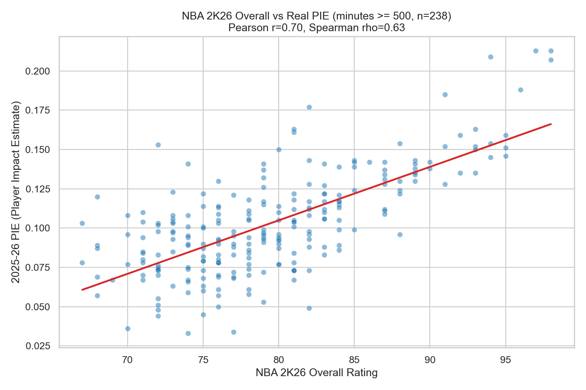
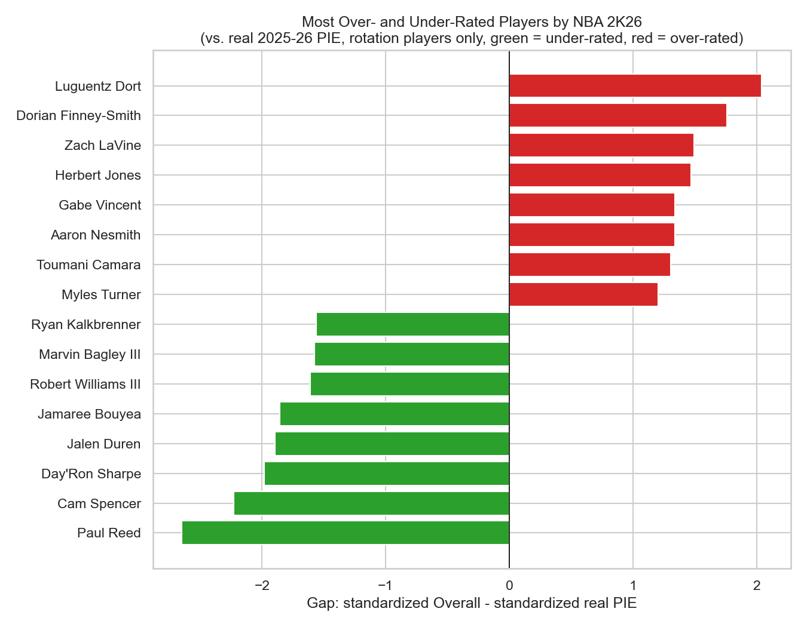
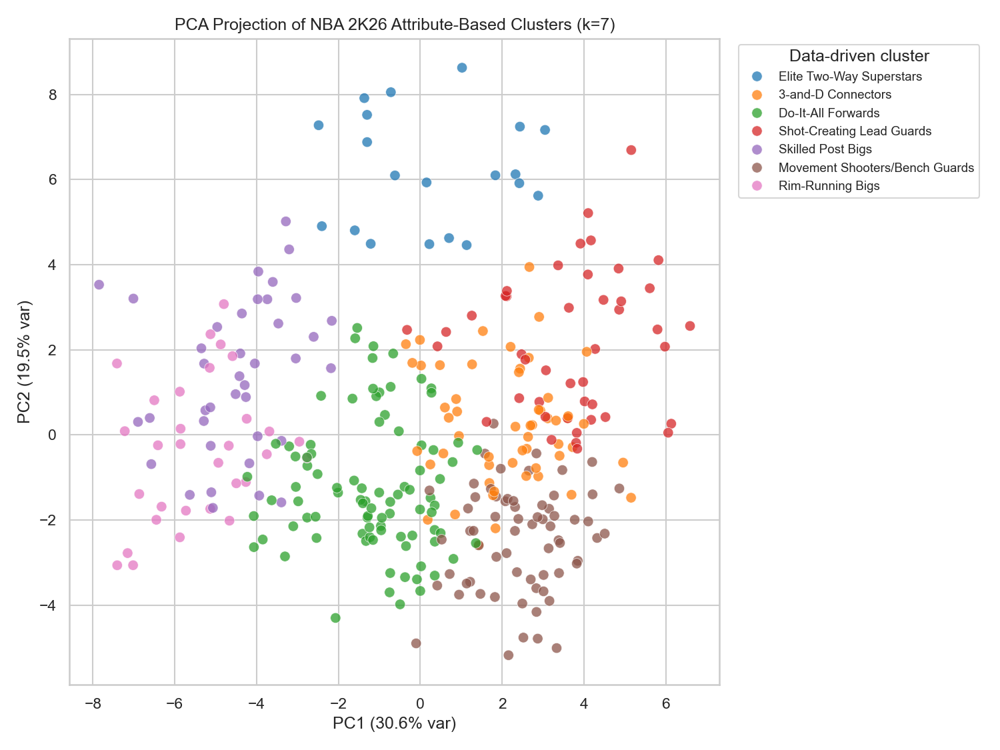
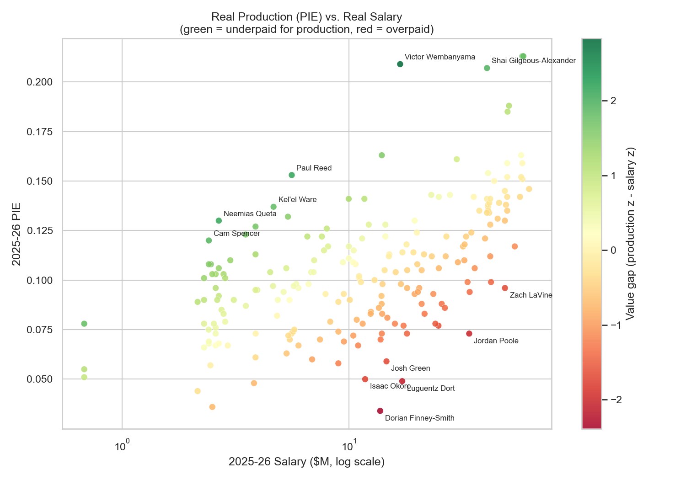

# NBA 2K26 Player Ratings Analysis

**Does a video game know basketball?** This project compares every NBA 2K26
in-game player rating (Overall, and all ~40 underlying attributes like
`pass_vision` or `perimeter_defense`) against what actually happened in the
real 2025-26 NBA season - box-score performance and salary - to answer three
questions:

1. **Does 2K's Overall rating actually track real on-court impact and market
   value**, or is it mostly reputation? (notebook 02)
2. **Do the ~40 granular attributes cluster into sensible playstyle
   archetypes on their own**, and how do those compare to the bespoke
   archetype labels 2K's designers already assign? (notebook 03)
3. **Which players does the game (and the market) get most wrong** - who is
   over/under-rated relative to real production, and who is a team over/underpaying
   relative to what a player actually delivered this season? (notebooks 02 & 04)

Everything below is generated straight from the merged dataset
(`data/processed/players_merged.csv`, 377 NBA 2K26-rated players matched to
real `nba_api` stats and HoopsHype salaries) - see
[`scripts/make_readme_charts.py`](scripts/make_readme_charts.py) to
regenerate the charts, or the numbered notebooks for the full analysis each
one is pulled from.

## Does the game's rating track reality?

The single strongest sanity check: among players with at least 500 minutes
played, 2K26's `overall` rating correlates strongly with real 2025-26 PIE
(Player Impact Estimate), a well-known real on/off-court impact box-score
metric (Pearson r = 0.70, Spearman rho = 0.63, n = 238). `overall` correlates
even more strongly with real salary (r = 0.84) - and in a regression, `overall`
alone explains far more of the variance in log salary than a player's age
does, so the rating is capturing a real, market-relevant skill signal rather
than just reputation or seniority.


*2K26 `overall` vs real Player Impact Estimate for rotation players (500+ minutes) - higher-rated players really do produce more.*

## Who does the game get wrong?

Correlation is strong but far from perfect - some players' 2K rating diverges
sharply from what their real box score says. Standardizing both `overall` and
real PIE and taking the gap surfaces the biggest misses in each direction:
mostly high-minutes role players whose quiet defensive/glue-guy value 2K
under-rates (Paul Reed, Cam Spencer, several bigs), versus players carrying
draft pedigree/reputation ahead of this season's production (Luguentz Dort,
Dorian Finney-Smith, Zach LaVine).


*Biggest gaps between 2K26 `overall` and real 2025-26 PIE, among rotation players - green bars are under-rated by the game, red bars are over-rated.*

## Do the attributes cluster into real archetypes?

2K already labels each player with a bespoke, designer-authored `archetype`
string (e.g. "2-Way 3-Level Shot Creator"). Running k-means (k=7, chosen via
silhouette score) directly on the ~40 granular attributes - with no position,
archetype, or box-score data involved - recovers seven data-driven playstyle
groups that align with basketball intuition (e.g. "Rim-Running Bigs" vs.
"Shot-Creating Lead Guards") and correlate with position and with 2K's own
archetype tokens, but only imperfectly: the attribute space has real
multidimensional structure that a single label can't fully capture.


*A 2D PCA projection of the 35 granular attributes, colored by k-means cluster (k=7) - clusters separate cleanly along skill-role lines even though position was never an input.*

## Moneyball: who's actually worth their contract?

Separately from the game's rating, we can ask a purely real-world question:
given actual 2025-26 production (PIE) and actual salary, who is a team
getting a bargain on, and who is overpaying? Standardizing production and
log-salary and taking the gap surfaces two kinds of value: young players
still on fixed rookie-scale deals (Victor Wembanyama), and prime-age
players who are just outperforming their pay grade (Shai Gilgeous-Alexander),
versus veterans being paid for a track record the current season hasn't
backed up.


*Real production vs. real salary (log scale) - green points are outproducing their contract, red points are being paid more than this season's production supports.*

## Data sources

- **NBA 2K26 ratings**: [`2kratings.com`](https://www.2kratings.com/) individual
  player pages, scraped via `scripts/scrape_2k_ratings.py`. **Important
  caveat**: by the time this project was built (mid-2026), the live
  2kratings.com site had already rolled forward to previewing *NBA 2K27*
  ratings (2K27 releases ~Sept 2026) - its live per-attribute list pages are
  labeled "on NBA 2K27", and individual player pages only keep a single
  historical Overall number per past edition, not the full attribute
  breakdown. To get real NBA 2K26 attribute-level data, the script instead
  pulls **Internet Archive (Wayback Machine) snapshots** of individual player
  pages captured while NBA 2K26 was current (mostly Aug 2025 - Feb 2026),
  verified via each snapshot's `<title>` tag reading "... NBA 2K26 Rating".
  This works well but is **not exhaustive**: the Wayback Machine didn't crawl
  every current-roster player during that window, so the dataset covers
  roughly 350-450 of the ~550 players who appeared on NBA rosters in the
  2025-26 season (stars, rotation players, and anyone whose page happened to
  get crawled) rather than the full league. Bench/two-way/mid-season-signee
  players are under-represented. Official `nba.2k.com/2k26/ratings` was also
  checked as a fallback and rejected: it only lists a JS-rendered Top 100.
- **Real 2025-26 NBA season stats**: [`nba_api`](https://github.com/swar/nba_api)
  (`LeagueDashPlayerStats`, Base + Advanced), which hits stats.nba.com's own
  JSON endpoints directly - no scraping or bot-evasion needed. Pulled by
  `scripts/fetch_nba_stats.py`.
- **Salaries**: [`hoopshype.com`](https://hoopshype.com/salaries/) per-team
  salary pages (`scripts/scrape_salary.py`). The league-wide `/salaries/players/`
  page is a Next.js app that only server-renders its top ~20 contracts
  client-side-paginated beyond that; the 30 per-team pages, however,
  server-render each team's full roster with multi-year contract data in an
  embedded `__NEXT_DATA__` JSON blob, which we parse directly instead of the
  HTML table.

## Project structure

```
scripts/                     data acquisition + processing pipeline
  scrape_2k_ratings.py         scrapes NBA 2K26 player attributes via Wayback Machine
  fetch_nba_stats.py           pulls real 2025-26 season stats via nba_api
  scrape_salary.py             scrapes 2025-26 salaries from HoopsHype (per-team pages)
  build_dataset.py             fuzzy-matches the three sources into one player table
  make_readme_charts.py        regenerates the charts embedded in this README
data/
  raw/                        untracked, gitignored (regenerate via scripts/)
  processed/                  small merged/cleaned CSVs, tracked in git
images/                      chart PNGs embedded in this README
notebooks/
  01_demographics.ipynb                       who's rated: position, height/weight/wingspan, age,
                                               nationality/college, team, badges/archetypes
  02_rating_validation.ipynb                  2K26 Overall + attributes vs real stats/salary ground truth
  03_archetypes_and_clustering.ipynb          k-means clustering on granular attributes vs 2K's own archetype labels
  04_similarity_and_value.ipynb               nearest-neighbor "statistical twins" + moneyball production-vs-salary value
  05_defense_and_playmaking_deep_dive.ipynb   which defense/playmaking attributes actually predict real box-score defense and assists
```

## Reproducing

```
pip install -r requirements.txt
python scripts/scrape_2k_ratings.py
python scripts/fetch_nba_stats.py
python scripts/scrape_salary.py
python scripts/build_dataset.py
jupyter notebook
```

No API keys are required for any of these - `nba_api` hits stats.nba.com's
public JSON endpoints directly, and the two scrapers use `curl_cffi`'s Chrome
TLS impersonation (plain `requests` gets a 403 from 2kratings.com/the Wayback
Machine's edge fairly often; `curl_cffi` reliably gets 200s).

## Limitations to keep in mind

- **2K26 ratings coverage is a real but incomplete slice of the league**
  (~350-450 of ~550 players), biased toward players whose 2kratings.com page
  got crawled by the Internet Archive during the 2K26 window - likely skewed
  toward more notable players, similar in spirit to fifa-analysis's
  Transfermarkt/Sofascore match-rate caveat.
- 2K26 attribute pages reflect a point-in-time snapshot (mostly the initial
  "launch" rating from ~Aug 2025, before most in-season roster updates), while
  the real stats are full 2025-26 season totals. A player's 2K rating may not
  reflect a late-season hot/cold streak the stats do capture.
- Name matching across sources is fuzzy (rapidfuzz, `players_merged.csv`
  records a match score per source) - spot-check any single-player finding
  against the raw data before treating it as ground truth.
- Defense is much harder to validate than playmaking or scoring: the box
  score only directly records steals and blocks, so attributes like
  `help_defense_iq` (positioning, closeouts, ball pressure) have no clean
  real-stat proxy and correlate only weakly with what box scores can measure
  (see notebook 05 for the position-by-position breakdown).
