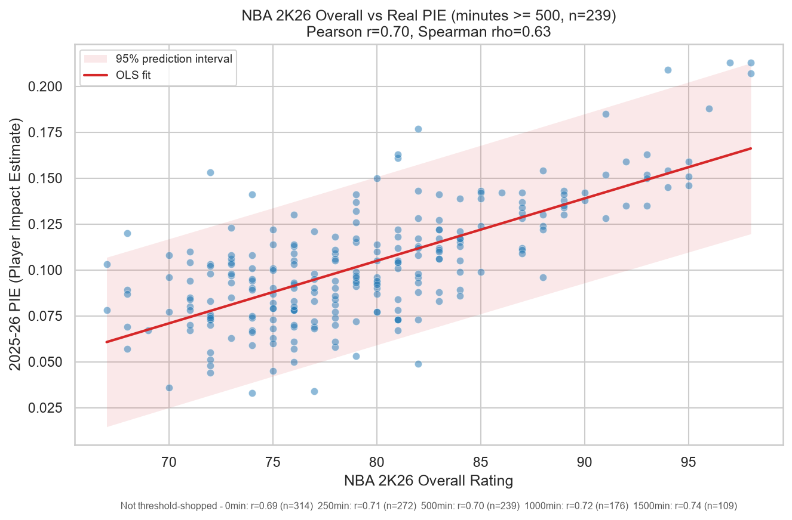
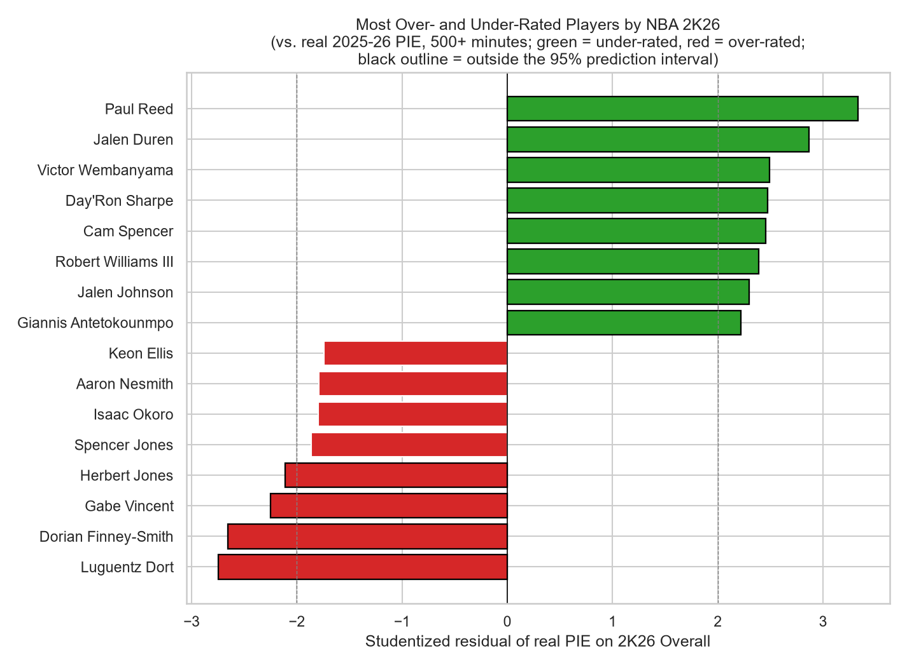
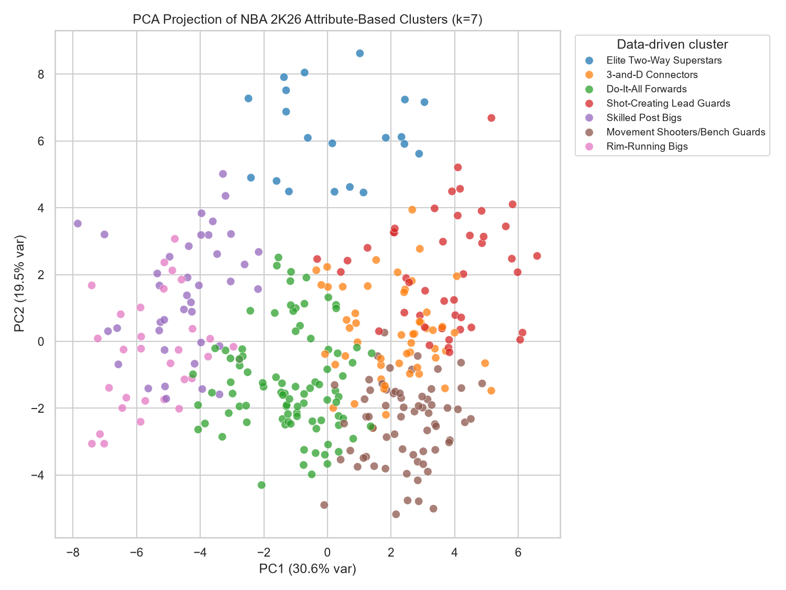
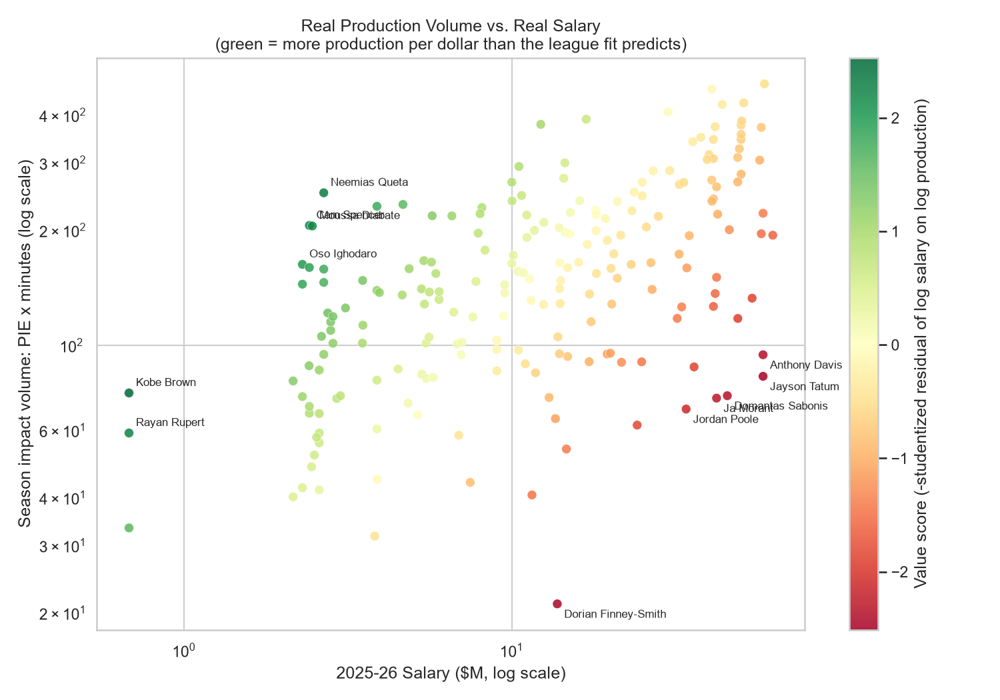

# NBA 2K26 Player Ratings Analysis

## Tech Stack


**Does a video game know basketball?** This project compares every NBA 2K26
in-game player rating (Overall, and all ~40 underlying attributes like
`pass_vision` or `perimeter_defense`) against what actually happened in the
real 2025-26 NBA season - box-score performance and salary - to answer three
questions:

1. **Does 2K's Overall rating actually track real on-court impact and market
   value**, or is it mostly reputation? (notebook 02)
2. **Do the ~40 granular attributes cluster into sensible playstyle
   archetypes on their own**, and how do those compare to the bespoke
   archetype labels 2K's designers already assign? (notebook 03)
3. **Which players does the game (and the market) get most wrong** - who is
   over/under-rated relative to real production, and who is a team over/underpaying
   relative to what a player actually delivered this season? (notebooks 02 & 04)

Everything below is generated straight from the merged dataset
(`data/processed/players_merged.csv`, 377 NBA 2K26-rated players matched to
real `nba_api` stats and HoopsHype salaries) - see
[`scripts/make_readme_charts.py`](scripts/make_readme_charts.py) to
regenerate the charts, or the numbered notebooks for the full analysis each
one is pulled from.

## Does the game's rating track reality?

The single strongest sanity check: among players with at least 500 minutes
played, 2K26's `overall` rating correlates strongly with real 2025-26 PIE
(Player Impact Estimate), a well-known real on/off-court impact box-score
metric (Pearson r = 0.70, Spearman rho = 0.63, n = 239). That headline number
is not an artefact of the 500-minute cut: r runs 0.69 / 0.71 / 0.70 / 0.72 /
0.74 at floors of 0 / 250 / 500 / 1000 / 1500 minutes (the footnote on the
chart below). `overall` correlates even more strongly with real salary
(r = 0.84) - and in a regression, `overall` alone explains far more of the
variance in log salary than a player's age does, so the rating is capturing a
real, market-relevant skill signal rather than just reputation or seniority.


*2K26 `overall` vs real Player Impact Estimate for rotation players (500+ minutes), with the OLS fit and its 95% prediction interval - higher-rated players really do produce more.*

## Who does the game get wrong?

Correlation is strong but far from perfect - some players' 2K rating diverges
sharply from what their real box score says. The right way to ask this is
"given how this player is rated, did they produce more or less than a *typical*
player with that rating?", i.e. the residual from the fit above, studentized so
every player is on a comparable scale. **Only 13 of 239 rotation players fall
outside the 95% prediction interval** - the game is inside its own error bars
for 95% of the league.

The biggest misses in each direction:

| Under-rated by 2K26 (produced more than their rating predicts) | Over-rated by 2K26 (produced less) |
|---|---|
| Paul Reed (+3.3), Jalen Duren (+2.9), **Victor Wembanyama (+2.5)**, Day'Ron Sharpe (+2.5), Cam Spencer (+2.5), Robert Williams III (+2.4), Jalen Johnson (+2.3), **Giannis Antetokounmpo (+2.2)** | Luguentz Dort (-2.7), Dorian Finney-Smith (-2.7), Gabe Vincent (-2.2), Herbert Jones (-2.1), Spencer Jones (-1.9), Isaac Okoro (-1.8), Aaron Nesmith (-1.8), Keon Ellis (-1.7) |

Two patterns: 2K systematically under-rates **high-motor bigs** whose value is
rebounding, finishing and rim protection (Reed, Duren, Sharpe, Williams), and
it over-rates **3-and-D wings** whose defensive reputation is real but whose
box-score footprint is thin (Dort, Finney-Smith, Okoro, Nesmith, Ellis) - which
is less a 2K error than a PIE blind spot, since PIE cannot see the defence
those players are paid for.

The genuine surprise is at the top. **Wembanyama and Antetokounmpo are
under-rated even at 94 and 97 overall**: their real production runs ahead of
what the league's rating-to-production curve predicts for players rated that
highly. An earlier version of this analysis could not have found that, because
it ranked players by `z(overall) - z(PIE)`, which structurally penalises anyone
with an extreme rating (see *A note on methodology* below).


*Studentized residual of real 2025-26 PIE on 2K26 `overall`, among rotation players - green is under-rated by the game, red is over-rated, black outline means the player falls outside the 95% prediction interval.*

## Do the attributes cluster into real archetypes?

2K already labels each player with a bespoke, designer-authored `archetype`
string (e.g. "2-Way 3-Level Shot Creator"). Running k-means (k=7, chosen via
silhouette score) directly on the ~40 granular attributes - with no position,
archetype, or box-score data involved - recovers seven data-driven playstyle
groups that align with basketball intuition (e.g. "Rim-Running Bigs" vs.
"Shot-Creating Lead Guards") and correlate with position and with 2K's own
archetype tokens, but only imperfectly: the attribute space has real
multidimensional structure that a single label can't fully capture.


*A 2D PCA projection of the 35 granular attributes, colored by k-means cluster (k=7) - clusters separate cleanly along skill-role lines even though position was never an input.*

## Moneyball: who's actually worth their contract?

Separately from the game's rating, we can ask a purely real-world question:
given actual 2025-26 production and actual salary, who is a team getting a
bargain on, and who is overpaying?

The unit matters here. PIE is a *rate* - a share of the statistical events that
happened while a player was on the floor - so comparing it directly against a
season salary rewards anyone who played a small number of good minutes. We
therefore measure production as **PIE x minutes**, a season impact *volume*
that is comparable to a season salary, and score value as the residual from
regressing log salary on log production (equivalently: dollars per PIE-minute,
which produces the identical top and bottom eight).

| Best value per dollar | Worst value per dollar |
|---|---|
| Kobe Brown ($9.0k/PIE-min), Neemias Queta ($10.7k), Rayan Rupert ($11.5k), Cam Spencer ($11.7k), Moussa Diabate ($12.0k), Oso Ighodaro ($14.1k), Ryan Kalkbrenner ($15.1k), Jamal Shead ($15.9k) | Jayson Tatum ($705k/PIE-min), Dorian Finney-Smith ($653k), Anthony Davis ($619k), Domantas Sabonis ($616k), Ja Morant ($579k), Jordan Poole ($500k), Zach LaVine ($417k), Jalen Green ($410k) |

The honest reading of the worst-value column is **availability, not
scouting**. Tatum, Davis, Sabonis and Morant all cleared the 500-minute
rotation bar and then missed most of the rest of the season; a max salary
bought 520-630 minutes. That is the single largest source of wasted payroll in
the league, and the previous rate-based metric could not see it at all, because
a per-possession rate does not care how many possessions you were available
for. The best-value column is structurally dominated by the CBA's salary floor:
a minimum contract is the same price whether the player is useless or a
rotation regular, so any minimum-salary player who logs real minutes lands
there. Notebook 04 repeats the exercise restricted to prime-age (25-32) players
to strip out the rookie-scale distortion.


*Season impact volume (PIE x minutes) vs. real salary, both log scale - green points deliver more production per dollar than the league-wide fit predicts, red points less.*

## A note on methodology

Two of the headline metrics above were previously computed as a difference of
z-scores, and both were replaced because the difference was measuring something
other than what it claimed to. The corrected versions live in
[`nba2k/metrics.py`](nba2k/metrics.py) and are unit-tested.

**Over/under-rated was `z(overall) - z(PIE)`.** If two variables correlate at
`r`, then `E[z(a) - z(b) | z(a)] = (1 - r) * z(a)`. At r = 0.70 that means 30%
of a player's standardized rating passes straight through into their "gap"
score, so the ranking was substantially a ranking of *who has an extreme
rating*, not *who diverges from their rating*. Measured on this dataset, the
old gap correlated **0.39 with `overall`**; the studentized residual that
replaced it correlates **0.001**. Concretely, the old metric put Zach LaVine on
the over-rated list mostly for being highly rated, and it was structurally
incapable of ever calling a 97-overall player under-rated, which is why
Antetokounmpo and Wembanyama were missing from the old list.

**Moneyball was `z(PIE) - z(log salary)`**, a per-possession rate against a
season total - see the section above.

Two smaller corrections in the same spirit: k-means cluster names are now
derived by matching centroid profiles rather than hardcoded to label indices
(which are arbitrary and permute with a scikit-learn, BLAS or row-order
change), and notebook 05's ~30 simultaneous correlation tests now carry
Benjamini-Hochberg FDR control and bootstrap confidence intervals instead of a
bare p < 0.05 green light.

## Data sources

- **NBA 2K26 ratings**: [`2kratings.com`](https://www.2kratings.com/) individual
  player pages, scraped via `scripts/scrape_2k_ratings.py`. **Important
  caveat**: by the time this project was built (mid-2026), the live
  2kratings.com site had already rolled forward to previewing *NBA 2K27*
  ratings (2K27 releases ~Sept 2026) - its live per-attribute list pages are
  labeled "on NBA 2K27", and individual player pages only keep a single
  historical Overall number per past edition, not the full attribute
  breakdown. To get real NBA 2K26 attribute-level data, the script instead
  pulls **Internet Archive (Wayback Machine) snapshots** of individual player
  pages captured while NBA 2K26 was current (mostly Aug 2025 - Feb 2026),
  verified via each snapshot's `<title>` tag reading "... NBA 2K26 Rating".
  This works well but is **not exhaustive**: the Wayback Machine didn't crawl
  every current-roster player during that window, so the dataset covers
  roughly 350-450 of the ~550 players who appeared on NBA rosters in the
  2025-26 season (stars, rotation players, and anyone whose page happened to
  get crawled) rather than the full league. Bench/two-way/mid-season-signee
  players are under-represented. Official `nba.2k.com/2k26/ratings` was also
  checked as a fallback and rejected: it only lists a JS-rendered Top 100.
- **Real 2025-26 NBA season stats**: [`nba_api`](https://github.com/swar/nba_api)
  (`LeagueDashPlayerStats`, Base + Advanced), which hits stats.nba.com's own
  JSON endpoints directly - no scraping or bot-evasion needed. Pulled by
  `scripts/fetch_nba_stats.py`.
- **Salaries**: [`hoopshype.com`](https://hoopshype.com/salaries/) per-team
  salary pages (`scripts/scrape_salary.py`). The league-wide `/salaries/players/`
  page is a Next.js app that only server-renders its top ~20 contracts
  client-side-paginated beyond that; the 30 per-team pages, however,
  server-render each team's full roster with multi-year contract data in an
  embedded `__NEXT_DATA__` JSON blob, which we parse directly instead of the
  HTML table.

## Project structure

```
nba2k/                       shared analysis package (imported by notebooks + scripts)
  constants.py                 attribute lists, thresholds, cluster names, random state
  data.py                      load_merged() and the sample filters
  metrics.py                   rating residuals, moneyball value, BH correction, bootstrap CIs
  clustering.py                k-means + centroid-profile-based cluster naming
tests/                       pytest suite over nba2k/ and the committed dataset
scripts/                     data acquisition + processing pipeline
  polite_http.py               robots.txt-aware, identifying, backing-off HTTP layer
  scrape_2k_ratings.py         scrapes NBA 2K26 player attributes via Wayback Machine
  fetch_nba_stats.py           pulls real 2025-26 season stats via nba_api
  scrape_salary.py             scrapes 2025-26 salaries from HoopsHype (per-team pages)
  build_dataset.py             fuzzy-matches the three sources into one player table
  make_readme_charts.py        regenerates the charts embedded in this README
data/
  raw/                        untracked, gitignored (regenerate via scripts/)
  processed/                  small merged/cleaned CSVs, tracked in git
images/                      chart PNGs embedded in this README
notebooks/
  01_demographics.ipynb                       who's rated: position, height/weight/wingspan, age,
                                               nationality/college, team, badges/archetypes
  02_rating_validation.ipynb                  2K26 Overall + attributes vs real stats/salary ground truth
  03_archetypes_and_clustering.ipynb          k-means clustering on granular attributes vs 2K's own archetype labels
  04_similarity_and_value.ipynb               nearest-neighbor "statistical twins" + moneyball production-vs-salary value
  05_defense_and_playmaking_deep_dive.ipynb   which defense/playmaking attributes actually predict real box-score defense and assists
```

## Reproducing

```
pip install -r requirements.txt
python scripts/scrape_2k_ratings.py
python scripts/fetch_nba_stats.py
python scripts/scrape_salary.py
python scripts/build_dataset.py
jupyter notebook
```

No API keys are required for any of these - `nba_api` hits stats.nba.com's
public JSON endpoints directly.

### Scraping policy

The two scrapers do use `curl_cffi`'s Chrome TLS impersonation, because plain
`requests` gets a 403 from 2kratings.com / the Wayback Machine's edge fairly
often. That is bot *detection* evasion, not paywall or login evasion, and it is
the one concession this project makes. Everything around it is deliberately
well-behaved, via `scripts/polite_http.py`:

- **robots.txt is fetched and honoured** before every request (checked at time
  of writing: both `web.archive.org` and `hoopshype.com` allow the paths used
  here). Set `RESPECT_ROBOTS=0` only if you know what you are doing.
- **Requests identify themselves**: the `User-Agent` and `From` headers carry
  this repository's URL and a contact email address, so anyone seeing the
  traffic can find out what it is and ask us to stop.
- **Rate limiting** respects any `Crawl-delay` the host declares, with a floor
  of 0.5s (archive) / 1.0s (HoopsHype) between requests.
- **429 and 5xx responses are retried with exponential backoff** (honouring
  `Retry-After`) and eventually raise, instead of being handed to the HTML
  parser and silently written out as an empty row - the previous behaviour.

Each scraped ratings row also records the exact Internet Archive capture it
came from (`wayback_ts`, `snapshot_url`) so the "these are launch ratings"
caveat below is checkable from the data rather than taken on trust. The
committed `data/processed/` extract predates that change and does not carry
those columns; they populate on the next scrape.

## Limitations to keep in mind

- **2K26 ratings coverage is a real but incomplete slice of the league**
  (~350-450 of ~550 players), biased toward players whose 2kratings.com page
  got crawled by the Internet Archive during the 2K26 window - likely skewed
  toward more notable players, similar in spirit to fifa-analysis's
  Transfermarkt/Sofascore match-rate caveat.
- 2K26 attribute pages reflect a point-in-time snapshot (mostly the initial
  "launch" rating from ~Aug 2025, before most in-season roster updates), while
  the real stats are full 2025-26 season totals. A player's 2K rating may not
  reflect a late-season hot/cold streak the stats do capture.
- Name matching across sources is fuzzy (rapidfuzz, `players_merged.csv`
  records a match score per source) - spot-check any single-player finding
  against the raw data before treating it as ground truth.
- Defense is much harder to validate than playmaking or scoring: the box
  score only directly records steals and blocks, so attributes like
  `help_defense_iq` (positioning, closeouts, ball pressure) have no clean
  real-stat proxy and correlate only weakly with what box scores can measure
  (see notebook 05 for the position-by-position breakdown).
